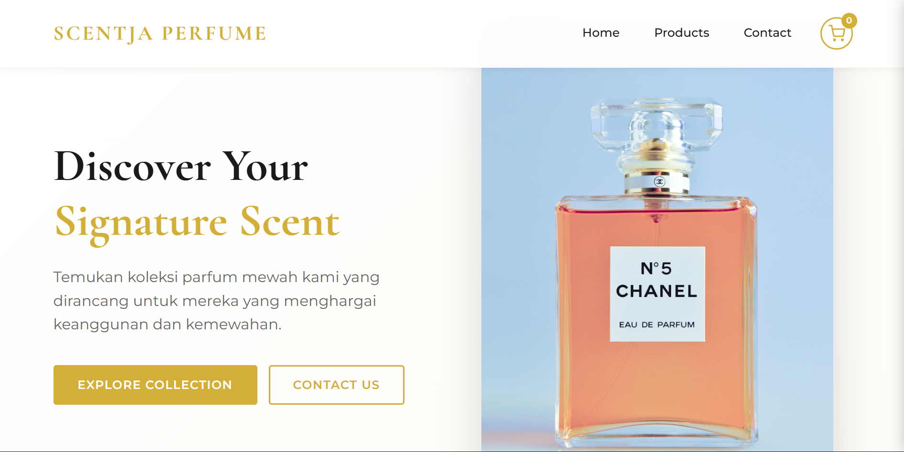
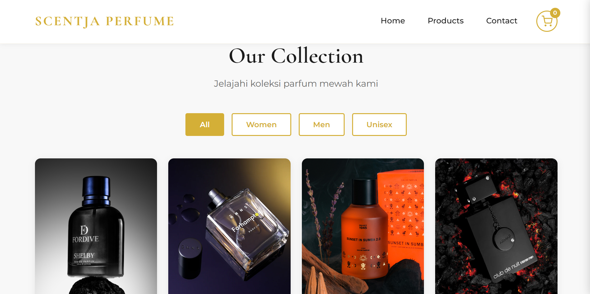
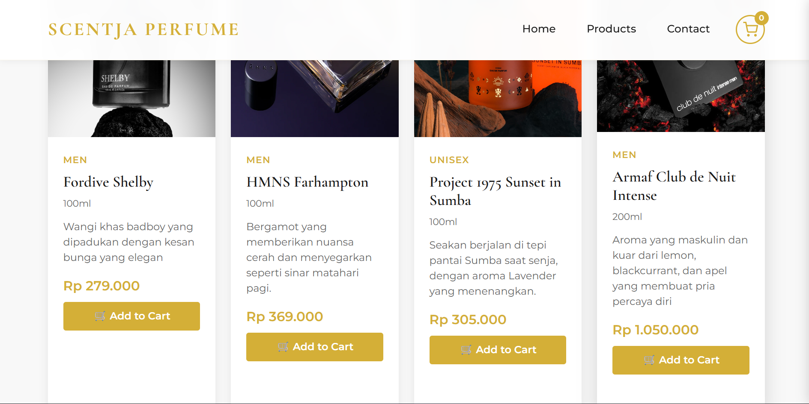
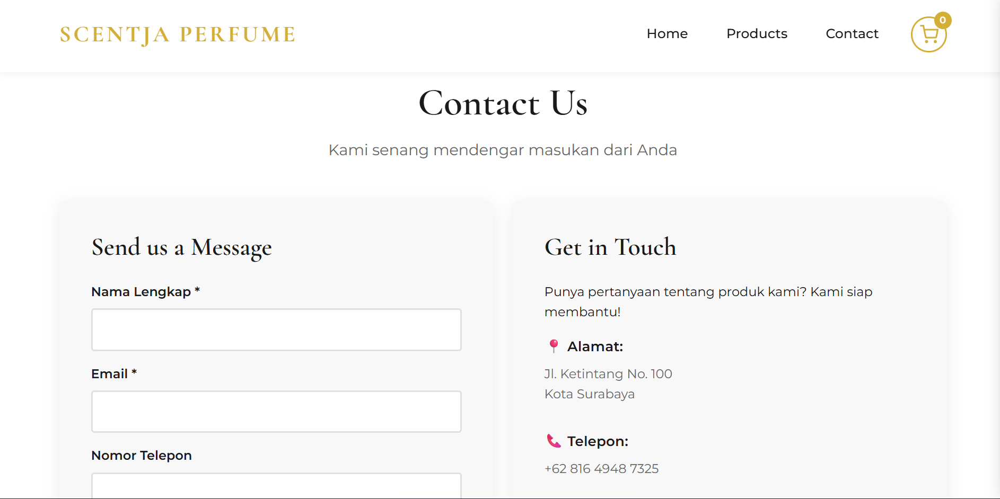
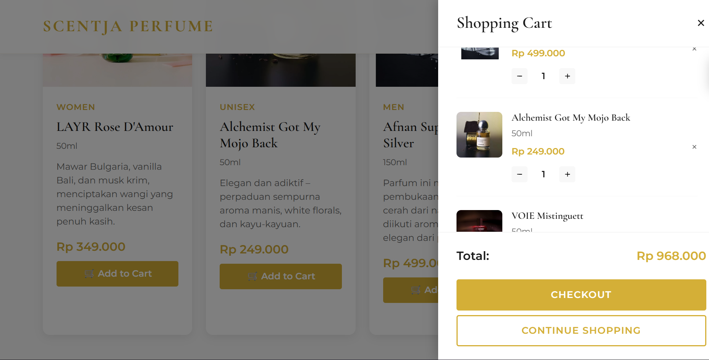
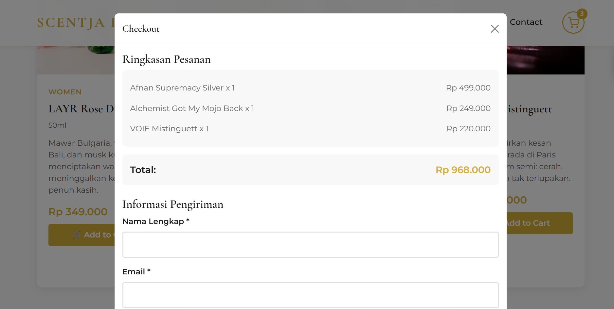

# Project-UTS-PBP---Scentja-Perfume
Website penjualan parfum ini dirancang sebagai platform digital yang memfasilitasi proses promosi dan penjualan berbagai jenis parfum secara efisien. Tampilan antarmuka mengusung konsep elegan dan modern dengan dominasi warna putih dan gold serta tata letak yang terstruktur, sehingga memberikan kesan profesional dan mewah. Desain yang responsif dan intuitif memastikan pengguna dapat dengan mudah menavigasi setiap halaman, menelusuri katalog produk, serta melakukan proses pembelian tanpa hambatan.
Setiap produk dilengkapi dengan deskripsi aroma dan harga yang jelas untuk mendukung pengambilan keputusan pembelian secara informatif. Dengan fokus pada kenyamanan pengguna dan estetika visual, website ini tidak hanya berfungsi sebagai media transaksi, tetapi juga sebagai sarana representasi identitas merek parfum yang eksklusif dan berkualitas.

# Tampilan Website

# LINK YOUTUBE
https://youtu.be/uvrPdAAGJfk
